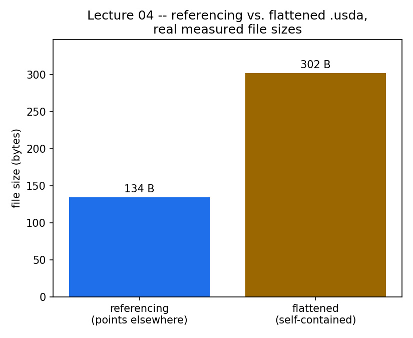

# Lecture 04 — Composition: References vs Flattening

**Code:** [`lecture04.py`](lecture04.py)

## The one thing this lecture teaches

You almost never build a scene from primitives the way lectures 2 and 3
did. You **reference** someone else's asset — a robot, a table, an entire
environment — into your own stage. USD gives you two fundamentally
different ways to end up with "the composed result": keep the reference
(small file, depends on the original continuing to exist) or **flatten**
it (bigger file, self-contained). Picking the wrong one for the situation
is how a 20 KB scene file turns into a 233 MB one, or how a scene that
worked yesterday breaks today because someone moved an asset it depends on.

## Run it

```bash
<your-isaac-sim-install>/python.sh lectures/lecture04.py
```

This one takes noticeably longer than lectures 1-3 — it boots a **second**,
nested Isaac Sim process partway through, on purpose. Read on for why that's
the only honest way to answer the question this lecture asks.

## What you'll see

```
LECTURE: wrote standalone asset to output_lecture04_asset.usda
LECTURE: wrote referencing scene to output_lecture04_referenced.usda
LECTURE: /World/Prop/Body valid via composition = True
LECTURE: exported flattened copy to output_lecture04_flattened.usda

LECTURE: raw text of the REFERENCING file (small, points elsewhere):
LECTURE:   #usda 1.0
LECTURE:
LECTURE:   def Xform "World"
LECTURE:   {
LECTURE:       def Xform "Prop" (
LECTURE:           prepend references = @output_lecture04_asset.usda@
LECTURE:       )
LECTURE:       {
LECTURE:       }
LECTURE:   }

LECTURE: raw text of the FLATTENED file (bigger, self-contained):
LECTURE:   #usda 1.0
LECTURE:   (
LECTURE:       doc = """Generated from Composed Stage of root layer .../output_lecture04_referenced.usda
LECTURE:   """
LECTURE:   )
LECTURE:
LECTURE:   def Xform "World"
LECTURE:   {
LECTURE:       def Xform "Prop"
LECTURE:       {
LECTURE:           def Cube "Body"
LECTURE:           {
LECTURE:               double size = 2
LECTURE:           }
LECTURE:       }
LECTURE:   }

LECTURE: file size -- referencing=134B  flattened=302B

LECTURE: moved output_lecture04_asset.usda out of the way
LECTURE: SAME PROCESS, referencing scene, asset missing -> /World/Prop/Body valid=True
LECTURE:   (if that says True, don't trust it yet -- read the .md before concluding the reference survived losing its file)
LECTURE: FRESH PROCESS,   referencing scene, asset missing -> /World/Prop/Body valid=False
LECTURE: restored output_lecture04_asset.usda
```



Only a 2.25x difference at this toy scale — one Cube with one attribute —
but the mechanism doesn't care about scale. A referenced warehouse with a
few hundred thousand mesh vertices produces the same few-kilobyte
referencing file and a flattened one hundreds of megabytes larger, for
exactly the reason this chart already shows in miniature.

A real windowed run of `lecture04.py`. This lecture works entirely with raw `Usd.Stage` objects written straight to `.usda` files on disk -- it never hands that content to Kit's own viewport -- so the window genuinely stays empty for the whole run even though the reference/flatten logic underneath is executing for real. That's the honest result of running it windowed, not a capture bug.


## Walking through it

**A reference is a pointer, not a copy.** `prop.GetReferences().AddReference("output_lecture04_asset.usda")`
authors one line — `references = @output_lecture04_asset.usda@` — into the
referencing file. Nothing about the Cube it points at is copied in. And yet
`referenced_stage.GetPrimAtPath("/World/Prop/Body")` reports valid — USD
**composes** the reference at access time, live, in memory. That composed
view is what every later lecture means by "the stage."

**The relative path resolves against the *layer*, not your terminal.**
`AddReference("output_lecture04_asset.usda")` has no directory in it at
all, and it still resolves — because USD looks for it next to the file
that contains the reference (`output_lecture04_referenced.usda`), not next
to wherever you happened to run `python.sh` from. This is the actual
mechanism behind the extremely common "works when I run it from the repo
root, breaks from anywhere else" complaint: the reference was never
relative to your current directory to begin with, so "cd-ing to the right
place" was never really the fix — it just happened to make the two paths
coincide.

**`Export()` composes everything down into one flat, self-contained
layer.** Compare the two files printed above: the flattened one has the
`Cube "Body"` written out directly, in place, with no `references` field
anywhere. It is a snapshot of the *composed result*, not a copy of the
reference arc. Even at this toy scale (134 B → 302 B) you can see the
shape of the problem: a referenced warehouse environment with a few
hundred thousand mesh vertices produces a referencing file of a few
kilobytes and a flattened one of hundreds of megabytes, because every
vertex gets baked into the output layer as literal text/binary data
instead of staying a pointer.

**Now the part that's easy to get wrong even once you know the theory: a
same-process check of "does it still work without the file" lies to you.**
Right after moving `output_lecture04_asset.usda` out of the way, the
script re-opens the referencing scene with a brand-new `Usd.Stage.Open()`
call — and the prim still reports `valid=True`. That's not a bug in this
lecture, and it's not USD being magically resilient. `Sdf`, USD's
lower-level layer library, keeps a **process-wide registry of every layer
it has ever opened**, keyed by resolved identifier. The asset layer got
into that registry earlier in this *same process*, when `asset_stage` was
first created — moving the file on disk doesn't evict it from memory. A
"fresh" `Stage.Open()` is fresh at the stage level; the layer cache
underneath it is not fresh at all.

**Which is why this script pays for a second Kit boot.** The only way to
ask the question honestly — "if I only have this file and the original
asset is really gone, does it still work" — is to ask a process that has
never touched either layer. The script does that with `subprocess.run()`,
resolving `python.sh` from `sys.executable` and running a small generated
checker script in a completely separate Isaac Sim instance. *That* check
says `valid=False`. This is the answer that matters in practice — it's
what actually happens when you close Isaac Sim today, someone reorganizes
an asset folder, and you reopen your scene tomorrow.

## Try it yourself

1. Do exactly this lecture's fresh-process check, but for the **flattened**
   file instead — move the asset away, then run a two-line script (copy the
   pattern from `lecture04.py`'s `checker_src`) opening
   `output_lecture04_flattened.usda` in its own fresh process. Confirm it
   stays `valid=True` even though the original asset file is gone — that's
   the entire reason flattening exists.
2. Reference the asset a *second* time at a different path
   (`/World/Prop2`), then check the flattened file's size again. Does
   flattening duplicate the Cube's data per-reference, or share it? (Hint:
   look for `def Cube "Body"` appearing once or twice in the flattened
   text.)
3. In your own future projects: when would you actually want a giant
   flattened file anyway, despite the size cost? (One real answer: shipping
   a single self-contained asset to someone who won't have your reference
   targets on their machine at all.)

## Next

[Lecture 05 — Physics Scene & Rigid Bodies](lecture05.md): every prim so
far has been geometry with no physical behavior. Time to make something
fall.
