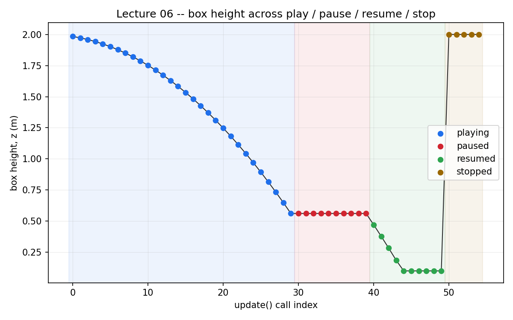

# Lecture 06 — The Simulation Loop and Timeline

**Code:** [`lecture06.py`](lecture06.py)

## The one thing this lecture teaches

`play()`, `pause()`, and `stop()` look like a symmetric triple — a toggle
plus a harder toggle. They're not. Each does something structurally
different to the simulation, and `kit.update()` — the thing you've been
calling in a loop since Lecture 01 — turns out to be a bundle of several
separate operations, not one atomic "step," which matters as soon as you
need to reason about render frames instead of physics steps (the subject of
the next couple of lectures).

## Run it

```bash
<your-isaac-sim-install>/python.sh lectures/lecture06.py
```

## What you'll see

```
LECTURE: playing, 30 steps  -> height=0.5612
LECTURE: paused,  10 more updates -> height=0.5612  (moved while paused: False)
LECTURE: resumed, 10 more updates -> height=0.1000  (continued falling from the paused height, not from the start: True)
LECTURE: stopped, 5 more updates  -> height=2.0000  (back to the original authored 2.0: True)

LECTURE: height before a direct physx_iface.update_simulation() call = 1.9836
LECTURE: height after that direct call (kit.update() never ran) = 1.9727  (physics advanced on its own: True)
```



Every dot is one real `kit.update()` call, not an interpolation — the flat
red segment and the vertical jump at the stop boundary are exactly what
the numbers above describe, just harder to miss at a glance.

## Walking through it

**`pause()` freezes the simulation in place and leaves it there.** After 30
steps the box is at 0.5612 m. Ten more `kit.update()` calls while paused,
and it's still 0.5612 m — the box's physics state exists and is readable,
it's just not advancing. This is the one that behaves the way its name
suggests.

**`play()` after a `pause()` resumes from exactly where it stopped, not
from the beginning.** The box continues falling from 0.5612 m down to
0.1000 m (resting on the ground) over the next 10 steps. The paused
interval didn't reset anything — it was a gap in stepping, not a rewind.

**`stop()` is not "pause, but more."** It's a hard reset. Five updates
after calling `stop()`, the box is back at height 2.0000 — its *original
authored* position, the one it never occupied again after step 1. Nothing
in the code told it to go back there; `stop()` did that on its own. Under
the hood, `stop()` tears down PhysX's live simulation view entirely and the
stage reverts to its authored (non-simulated) state, which is exactly the
2.0 m you wrote in `build_falling_box_scene()`. The next `play()` builds a
fresh simulation view from scratch — which is also why, in more complex
scenes with articulations, anything that cached a reference to the old
simulation view (a physics handle obtained before the `stop()`) goes stale
and has to be re-fetched after the next `play()`. You won't hit that in
this lecture's simple rigid body, but it's the same mechanism, and it's
worth recognizing the shape of it now.

**`kit.update()` is a bundle: UI, rendering, and physics all pumped
together in one call.** That's convenient — it's why every previous lecture
could just loop on it — but it's not the only granularity available.
`omni.physx.get_physx_interface()` exposes `update_simulation()` directly:
call it and the box's height changes (1.9836 → 1.9727 m) *without a single
`kit.update()` in between*. Physics stepped on its own, decoupled from
rendering and from the timeline's own bookkeeping. You won't need this
low-level interface often — `kit.update()` is the right tool for almost
everything in this course — but knowing it exists matters for what's
coming next: rendering has its own notion of "not done yet" that has
nothing to do with whether physics has settled, and that's only visible
once you stop assuming one `update()` call means one indivisible unit of
"the simulation moved forward."

## Try it yourself

1. Call `timeline.stop()` a second time in a row, with no `play()` in
   between. Does anything break? (It shouldn't — `stop()` on an
   already-stopped timeline is a no-op, which is worth confirming rather
   than assuming.)
2. After the final `stop()` in the script, call `timeline.play()` again and
   step it a few times. Does the box fall the exact same way it did the
   first time? (It should — `stop()` genuinely reset everything, including
   whatever accumulated simulation time had passed.)
3. Change the direct `physx_iface.update_simulation()` call's first
   argument (currently `1.0 / 60.0`) to something much larger, like `0.5`.
   Does the box move further in that one call? This is the actual physics
   timestep being handed to PhysX — `kit.update()` normally chooses this
   for you.

## Next

[Lecture 07 — Cameras and Rendering](lecture07.md): now that "the simulation
moved forward" and "the simulation looks right" are visibly two different
claims, it's time to actually look — creating a camera, capturing a frame,
and saving it as an image you can open yourself.
