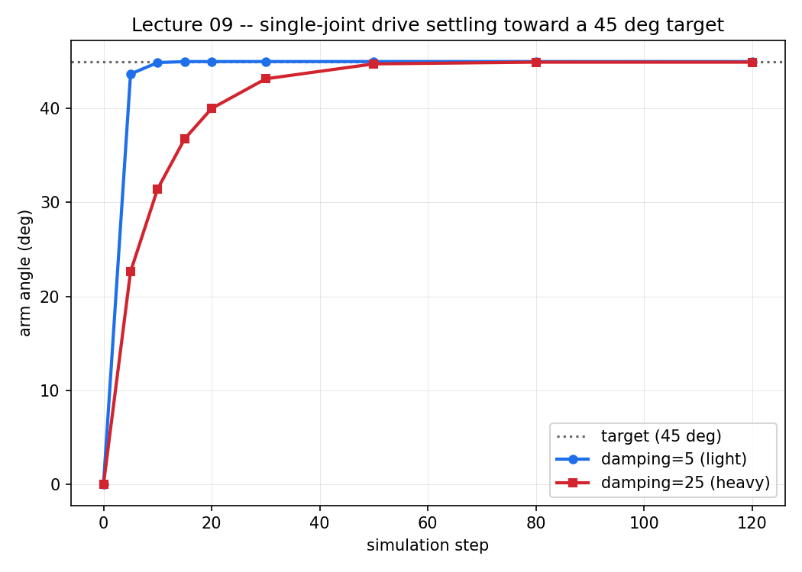

# Lecture 09 — Articulations and Joint Drives

**Code:** [`lecture09.py`](lecture09.py)

## The one thing this lecture teaches

A joint drive doesn't teleport a joint to a target angle — it's a
spring-damper pulling toward one, the same shape as a PD controller,
because that's functionally what it is. `stiffness` says how hard it pulls
toward the target; `damping` says how hard it resists moving quickly. And
because it's a spring fighting a constant load (gravity, here), where it
*settles* isn't quite the same number as what you asked for — a small,
genuinely instructive gap between "commanded" and "achieved" that's worth
seeing with real numbers instead of assuming it away.

## Run it

```bash
<your-isaac-sim-install>/python.sh lectures/lecture09.py
```

## What you'll see

```
LECTURE: driving a single hinge joint to a 45.0 deg target, against gravity
LECTURE:  step    damping=5 (deg)   damping=25 (deg)
LECTURE:     0             -0.000             -0.000
LECTURE:     5             43.734             22.667
LECTURE:    10             44.907             31.454
LECTURE:    15             45.001             36.785
LECTURE:    20             45.008             40.020
LECTURE:    30             45.008             43.174
LECTURE:    50             45.008             44.762
LECTURE:    80             45.008             44.943
LECTURE:   120             45.008             44.943

LECTURE: damping=5 settles at 45.008 deg (reaches the target fast)
LECTURE: damping=25 settles at 44.943 deg (reaches it smoothly, slower, and neither value is exactly 45.0 -- see lecture09.md)
```



Same numbers as the table above, but the shape is the actual point: both
curves head toward the dotted target line and both stop just short of it,
one fast, one gradual.

A real windowed run of `lecture09.py`, the driven articulated arm visible in the viewport as the joint drive settles under load.


## Walking through it

**Four pieces build one articulation, and each does a distinct job.** The
base gets `ArticulationRootAPI` — this marks it as the root of a
reduced-coordinate PhysX articulation, the solver mode built for chains of
joints (this lecture's chain is one link long, but the mechanism scales up
to a full arm without changing shape). A `FixedJoint` with only `Body1`
set pins that root to the world itself — nothing anchors a `RigidBodyAPI`
prim in place by default, including this one; without the fixed joint, the
"base" would just fall like Lecture 05's box. The `RevoluteJoint` connects
base to arm and defines the one degree of freedom between them. And

**"Fixed" only fixes to wherever the anchors actually agree, and that took
an actual bug to find.** A `FixedJoint` with only `Body1` set makes side 0
of the joint *be* the world frame — but its local anchor is still just a
point, and left at the default it's `(0, 0, 0)` **in world coordinates**,
which is the world origin, not wherever `Body1` happens to sit. The first
version of this lecture didn't set `fixed.CreateLocalPos0Attr(...)` at
all — and Base got silently dragged from `(0, 0, 1.0)` down to the world
origin the instant `timeline.play()` ran, every single time, with no
error and no warning. It stayed invisible here because this lecture never
checks Base's own position, only the arm's *angle*, and the angle
dynamics don't care what height the whole assembly sits at. It stopped
being invisible the moment [Lecture 10](lecture10.md) put a floor at
`z = 0` into the same scene and the wrongly-anchored base collided with
it. The fix is one line —
`fixed.CreateLocalPos0Attr(Gf.Vec3f(*BASE_POS))`, giving side 0's anchor
the same world position Base is actually placed at — and the lesson is the
same one this course keeps landing on: a value defaulting to something
plausible-looking is not the same as it defaulting to *correct*, and the
only way to tell them apart is to check a number, not read the code and
nod.
`DriveAPI`, applied *to the joint*, is what actually commands it — a joint
with no drive applied would swing freely under gravity like a real,
un-actuated pendulum, which is worth trying (see below).

**Both local anchor points are `(0, 0, 0)`, and that's a modeling choice,
not a coincidence.** `/World/Base` and `/World/Arm` are both translated to
the same world point, `(0, 0, 1.0)` — that point is the physical pivot.
The arm's visible geometry (`/World/Arm/Geom`) is what's offset half a
meter away from its parent's origin, not the parent itself. Put the pivot
anywhere else and the joint's `localPos0`/`localPos1` would need to encode
that offset by hand; keeping the arm's *origin* at the pivot means they
don't have to.

**`damping=5` looks like it "just reaches the target."** By step 15 it's
at `45.001°`, and every checkpoint after that reads `45.008°` — close
enough to the `45.0` target to look, at a glance, like it got there. It
didn't, quite, and neither run ever does — see the next point.

**`damping=25` makes the approach visibly gradual, and that's the point of
comparing the two.** Same stiffness, same target, same gravity load —
`22.667°` at step 5 where the other run was already at `43.734°`, still
climbing at step 50, only just settled by step 80. Higher damping resists
*velocity*, not distance from the target, so the same spring pull now
fights a stronger brake the whole way there. This is what "damping"
concretely does to a driven joint, watchable instead of definitional.

**Neither run settles at exactly `45.0`, and that's not noise.** `45.008`
and `44.943` are both a genuine steady-state error, not run-to-run
jitter — rerun the script and both numbers come back identical, because
gravity's torque on the arm is constant and deterministic. A
proportional-plus-damping drive at equilibrium balances *spring force
against load*, not *position against target* — it settles wherever those
two forces cancel, which is near the target, not exactly on it, whenever
there's a constant external load pulling away from it. This is a small
instance of a real control-systems fact, not a coincidence of this
lecture's numbers: closing that gap exactly needs either much higher
stiffness (a stiffer spring makes the same load produce a smaller angular
offset) or an integral term the way a full PID controller has, and this
simple drive has neither.

## Try it yourself

1. Remove the `UsdPhysics.DriveAPI.Apply(...)` block entirely and rerun.
   The joint still exists, but nothing commands it — watch the arm swing
   like a real pendulum instead of holding a target. This is the
   "un-actuated joint" case the drive normally hides.
2. Raise `stiffness` from `150.0` to `5000.0` (keep `damping=25.0`). Does
   the final resting angle get closer to `45.0`? By how much, roughly?
3. Change `scene.CreateGravityMagnitudeAttr(9.81)` to `0.0`. With no load
   fighting the drive, does either run settle at exactly `45.000`? That's
   the cleanest way to confirm the steady-state gap really is a
   load-vs-spring balance, not some other source of error.

## Next

[Lecture 10 — Capstone](lecture10.md): every fundamental from Lectures
01–09 — stage and prims, transforms, composition, physics and gravity, the
timeline, a camera, lights that actually reach what they're supposed to,
and now a driven joint — combined into one scene, captured as a single
final frame.
