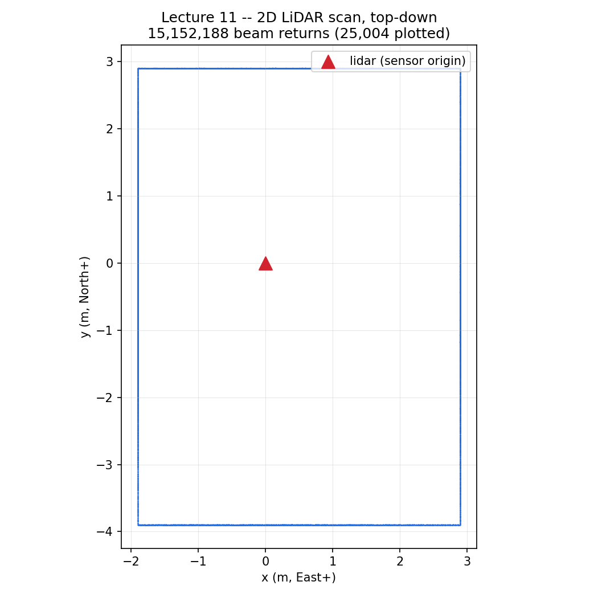
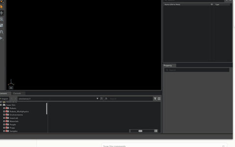

# Lecture 11 — 2D LiDAR

**Code:** [`lecture11.py`](lecture11.py)

## The one thing this lecture teaches

The RTX Lidar sensor doesn't hand you `(x, y, z)` points. It hands you a
`GenericModelOutput` (GMO) struct with fields *named* `x`, `y`, `z` — and by
default, those are `(azimuth_deg, elevation_deg, distance_m)`, not cartesian
coordinates at all. Nothing in the API stops you from running cartesian
trigonometry on them anyway. Nothing throws, nothing warns, and the numbers
that come out still look exactly like a plausible lidar reading. This
lecture exists because that trap cost real time to escape, and the fix —
`gmo.elementsCoordsType`, check it, don't assume it — is one line.

## Run it

```bash
<your-isaac-sim-install>/python.sh lectures/lecture11.py
```

Workstation-specific gotcha, same one Lecture 08's dome-light story doesn't
touch but this sensor absolutely does: this machine's two GPUs have no CUDA
peer access, and the RTX renderer's default of spreading raytracing work
across both breaks the lidar readback pipeline outright (`invalid magic
number` instead of real points). `SimulationApp({..., "multi_gpu": False,
"active_gpu": 0})` at the top of `lecture11.py` fixes it. If you're on a
single-GPU box you don't need this, and it's harmless either way.

## What you'll see

```
LECTURE: scanning the room at its authored scale (1x)...
LECTURE: numberOfChannels attribute = 128
LECTURE:   elementsCoordsType = <CoordsType.SPHERICAL: 1> -- x/y/z below are read as (azimuth, elevation, distance)
LECTURE:   captured 15152204 beam returns
LECTURE:   elevation range = [0.00, 0.00] deg -- this config really is single-ring 2D (elevation ~= 0 for every point)
LECTURE:   azimuth coverage = [-180.0, 180.0] deg over 128 distinct channel IDs
LECTURE: rebuilding the same room 4.0x bigger and scanning again...
LECTURE:   captured 14922791 beam returns
LECTURE: 128/128 channels scaled distance by ~4.0x as expected when the room grew 4.0x.
LECTURE: 2D scan sampled every 45deg (nearest point, within 10deg):
LECTURE:   azimuth  -180deg -> 1.90 m
LECTURE:   azimuth  -135deg -> 2.32 m
LECTURE:   azimuth   -90deg -> 3.89 m
LECTURE:   azimuth   -45deg -> 3.54 m
LECTURE:   azimuth     0deg -> 2.89 m
LECTURE:   azimuth    45deg -> 3.53 m
LECTURE:   azimuth    90deg -> 2.89 m
LECTURE:   azimuth   135deg -> 2.32 m
LECTURE: compare against the room: East(az 0)=3m North(az 90)=3m West(az +-180)=2m South(az -90)=4m
```



Every point in that plot is a real decoded `(azimuth, distance)` pair
converted to `(x, y) = (dist·cos(az), dist·sin(az))` — not a drawing of
what the room "should" look like. The rectangle it traces is the same
lopsided room the script builds (`x` in `[-2,3]`, `y` in `[-4,3]`), and the
four straight edges are the four walls, each made of hundreds of thousands
of individual beam returns from a rotating sensor, not four line segments
someone typed in.

Every number lines up: azimuth 0° (facing the room's East wall, 3m away at
room-center) reads 2.89m; 90° (North, 3m) reads 2.89m; -90° (South, 4m)
reads 3.89m; ±180° (West, 2m) reads 1.90m. The consistent ~0.1m gap is the
sensor sitting slightly off the room's geometric center — real geometry,
not error.

A real windowed run of `lecture11.py`, the walled room and the `Lidar` prim's ray lines visible in the viewport as the 2D scan is captured (the flat top-down scatter plot above is built from this same scan's return data).



## Walking through it

**Read `elementsCoordsType`, don't assume it.** `GenericModelOutput` has no
fields called `azimuth` or `distance` — it has `x`, `y`, `z`, and a
`CoordsType` enum (`CARTESIAN`, `SPHERICAL`, `NOT_APPLICABLE`) telling you
what those three numbers actually mean. This sensor config's default is
`SPHERICAL`, confirmed by reading the field directly off a live sensor and
cross-checked against NVIDIA's own `gmo_lib` documentation shipped inside
the install
(`extscache/omni.sensors.nv.common-*/bin/gmo_lib/docs/generic_model_output.rst`):
under `SPHERICAL`, `x` = azimuth in degrees, `y` = elevation in degrees, `z`
= distance in meters. `lecture11.py` asserts this instead of hoping for it —
if you're on a config where it reports `CARTESIAN` instead, the script tells
you and stops, rather than silently computing nonsense.

**Cartesian trigonometry on spherical fields fails silently, and that's
what makes it dangerous.** An earlier version of this script computed
`dist = sqrt(x**2 + y**2 + z**2)`, `azimuth = atan2(y, x)`,
`elevation = atan2(z, sqrt(x**2+y**2))` — completely reasonable code, if `x,
y, z` were cartesian. They weren't. Feeding `(azimuth_deg, elevation_deg,
distance_m)` — numbers like `(46.2, 0.0, 3.1)` — through that formula
produces a *different*, still-plausible-looking number: distances in the
tens of meters, elevations approaching 90°, nothing that trips a range
check or throws an exception. That run classified only 64 of 128 channels
as "trustworthy" (their apparent distance happened to scale correctly under
a 4x room resize purely by coincidence of the math) and reported an azimuth
range stuck at `[0, 180]` no matter how long it ran. Both symptoms looked
exactly like a sensor or scene bug. Neither was. The fix wasn't in the
scene, the tick count, or the writer — it was reading three fields
correctly instead of computing three fields wrong.

**The `_2D` name is honest after all.** An earlier hypothesis in this
lecture's development held that `numberOfChannels = 128` meant the config
was secretly a multi-ring 3D lidar mislabeled `_2D`, because points looked
spread across a wide elevation range — a direct consequence of the same
cartesian-on-spherical bug (`atan2(z, sqrt(x²+y²))` on already-polar data
produces near-arbitrary "elevation" values). With the fields read correctly,
elevation is `0.00` degrees for every single one of the ~15 million points
captured. The 128 channels are real, but they're not elevation rings —
they're azimuth-direction beam groups fired within the sensor's single
rotating plane. "2D" describes the *scan*, correctly; `numberOfChannels`
describes something else about the emitter, and the two aren't in tension.

**`CaptureWriter` accumulates across ticks, and that fix stands on its
own.** A rotary lidar only covers part of its azimuth sweep per simulation
tick — it's spinning, not flashing 360° at once. An earlier version of this
writer did `captured["gmo"] = gmo`, overwriting on every `write()` call, so
only the *last* tick's partial sweep was ever analyzed — a second, separate
bug from the coordinate one, independently real, independently fixed by
appending every tick's frame to a list instead. Between the two fixes,
`200` ticks is enough to accumulate a full `[-180, 180]` sweep; there's
nothing magic about that number, it was found by running and checking the
printed azimuth coverage, the same way every number in this course gets
chosen.

**`gmo.x` is already a numpy array — read the type stub, not just the
field name.** The GMO Python bindings' `.pyi` stub declares
`x: numpy.ndarray`. An earlier version of this writer ignored that and
rebuilt each array element-by-element in a Python loop
(`np.array([gmo.x[i] for i in range(n)])`) — correct, but needlessly slow
across frames with hundreds of thousands of points each. `np.array(gmo.x)`
does the same job as a single native copy.

**The scale-verification step is now a real safety check, not a rescue.**
Scanning the same room at 1x and again at 4x and confirming each channel's
median distance scales by ~4x isn't specific to the coordinate bug — it's a
general sanity check worth keeping for any lidar setup, this course's or
your own: if a reported "hit" doesn't move when the geometry it's supposedly
measuring does, something's still wrong upstream. With the fields read
correctly, it now passes at `128/128`, not `64/128` — full agreement, not a
coincidence-driven split.

## Try it yourself

1. Comment out the `elementsCoordsType` check and replace `az_deg, el_deg,
   dist_m = raw_x, raw_y, raw_z` with the cartesian formula described above
   (`sqrt`/`atan2`). Rerun and compare the compass output to this lecture's —
   does it still look like a room, or does it look like a sensor problem?
2. Change `SCALE` from `4.0` to `1.5`. Does the channel-tracking check still
   pass at or near `128/128`? How small can you make it before the `abs(ratio
   - SCALE) < 0.5` tolerance starts rejecting real, correctly-scaled
   channels?
3. Print `np.unique(scan1["channel_id"])` and, separately, sort points by
   `channelId` for a single fixed azimuth window. Does channel ID track
   azimuth in a simple, predictable order, or does it look multiplexed?
   That's the real answer to what the "128 channels" of this rotary 2D
   config represent.

## Next

[Lecture 12 — 3D LiDAR](lecture12.md): the same `GenericModelOutput`
decoding pipeline, the same `elementsCoordsType` check — this time on a
config where elevation genuinely isn't zero, and the 2D lecture's "single
ring" simplification has to go.
