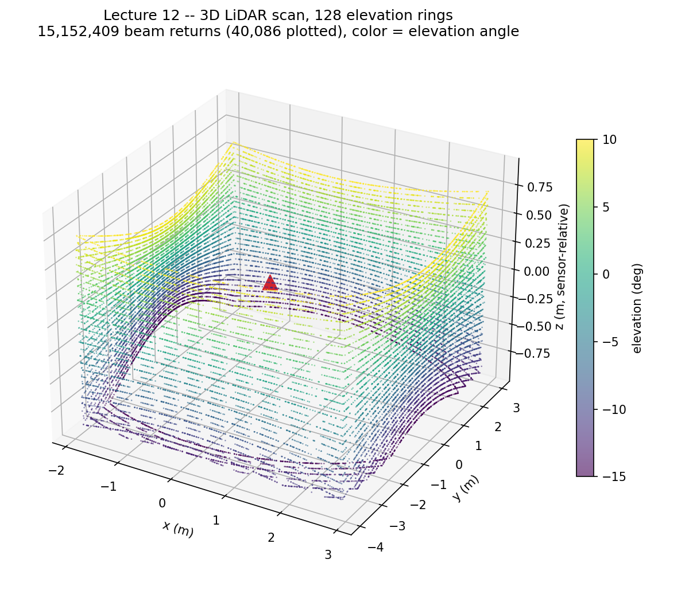

# Lecture 12 — 3D LiDAR

**Code:** [`lecture12.py`](lecture12.py)

## The one thing this lecture teaches

Lecture 11 found that `Example_Rotary_2D`'s elevation field is `0.00`
degrees for every point, and concluded that config really is a flat, single
-ring 2D scan. That conclusion was correct — for that config. It was never
a fact about the RTX Lidar API in general. Swap in `Example_Rotary` (no
`_2D`) and the exact same decoding pipeline — same `elementsCoordsType`
check, same `(x, y, z) = (azimuth, elevation, distance)` fields — now reads
a real spread of 32 elevation rings from -15° to +10°. Same code, same
sealed room, genuinely different sensor behavior. The lesson isn't new
code; it's that Lecture 11's finding was scoped to what it actually tested.

## Run it

```bash
<your-isaac-sim-install>/python.sh lectures/lecture12.py
```

Same `multi_gpu=False, active_gpu=0` workaround as Lecture 11, same reason
(this workstation's two GPUs have no CUDA peer access, and RTX Lidar
readback can't cope with work split across both).

## What you'll see

```
LECTURE: scanning the room at its authored scale (1x)...
LECTURE: numberOfChannels attribute = 128
LECTURE:   elementsCoordsType = <CoordsType.SPHERICAL: 1> -- x/y/z below are read as (azimuth, elevation, distance)
LECTURE:   captured 15152470 beam returns
LECTURE:   elevation range = [-15.00, 10.00] deg across 32 distinct elevation rings -- this one is genuinely 3D
LECTURE:   azimuth coverage = [-180.0, 180.0] deg over 128 distinct channel IDs
LECTURE:   distance range = [1.90, 4.94] m (config farRangeM=200 -- nothing near that means every ray hit the sealed room, none escaped)
LECTURE: rebuilding the same room 4.0x bigger (mount height scales too) and scanning again...
LECTURE:   captured 14923165 beam returns
LECTURE: 128/128 channels scaled distance by ~4.0x as expected when the room (and mount height) grew 4.0x.
LECTURE: vertical profile -- median distance per elevation ring (32 rings, sampled every few):
LECTURE:   elevation -15.00deg -> median distance  3.18 m over 474576 returns
LECTURE:   elevation -11.77deg -> median distance  3.13 m over 473323 returns
LECTURE:   elevation  -8.55deg -> median distance  3.10 m over 473353 returns
LECTURE:   elevation  -5.32deg -> median distance  3.08 m over 473495 returns
LECTURE:   elevation  -2.10deg -> median distance  3.07 m over 473460 returns
LECTURE:   elevation   1.13deg -> median distance  3.07 m over 473500 returns
LECTURE:   elevation   4.35deg -> median distance  3.08 m over 473454 returns
LECTURE:   elevation   7.58deg -> median distance  3.09 m over 473410 returns
```



Each ring in that plot is one elevation channel's full azimuth sweep,
plotted from the real `(azimuth, elevation, distance)` triples converted to
cartesian (`x=dist·cos(el)·cos(az)`, `y=dist·cos(el)·sin(az)`,
`z=dist·sin(el)`). The 32 rings never actually reach the floor or ceiling —
they curve *toward* them without touching, which is exactly the "every ray
hits a wall, none the floor or ceiling" finding this lecture's vertical
profile makes numerically below.

## Walking through it

**`Example_Rotary`'s emitter layout genuinely spans elevation, unlike
Lecture 11's `_2D` config.** The config JSON
(`.../data/lidar/Example_Rotary.json`) lists 128 emitters as 4 azimuth-
offset groups of 32 elevation values each, `-15.0` to `10.0` in ~0.8°
steps. `numberOfChannels` still reads `128` — same number Lecture 11 saw —
but this time it's telling the truth about elevation variation instead of
describing azimuth-multiplexing within a single flat ring. Same attribute,
same value, different meaning per config; you have to check what a given
config actually does, not infer it from one number.

**The scale-verification check generalizes without changes.** Rebuild the
same room 4x bigger — including mount height, since `translations` is
scaled by `room_scale` too — and rescan: `128/128` channels track the 4x
distance change, same as Lecture 11's `128/128` once that lecture's
coordinate bug was fixed. Nothing about moving to a real elevation spread
required touching this check; a real-hit distance scales with the geometry
it's measuring regardless of which elevation ring reported it.

**No ray reached the 200m far range — confirmation the sealed room from
Lecture 11 is still doing its job.** `Example_Rotary`'s `farRangeM` is
`200.0`; this scan's actual max distance is `4.94m`. If a ray had escaped
through a gap, this is exactly where it would show up, as a value near
200 sitting far outside the rest of the distribution — and it doesn't.

**The vertical profile's shape is `1/cos(elevation)`, not "floor vs
wall."** The first guess — steep negative elevations hit the floor
(short range), near-zero hits the walls, positive hits the ceiling — is
wrong for this room, and checking the actual numbers is what catches that.
This room's walls span the *full* floor-to-ceiling height
(`wall_specs`' z-scale is `2.0 * room_scale`, exactly matching the
floor/ceiling gap) — so a wall is always in the way before any ray could
reach the floor or ceiling, at every elevation this sensor fires. The only
thing elevation changes is the *slant* distance to that same wall: a level
ray (elevation 0°) travels the wall's horizontal distance directly; a
tilted ray has to travel further to cover the same horizontal ground,
by a factor of `1 / cos(elevation)`. Taking the near-level median (`3.07m`)
as the horizontal baseline and applying that formula to each ring:

| elevation | observed | `3.07 / cos(e)` | diff |
|---:|---:|---:|---:|
| -15.00° | 3.18 m | 3.178 m | +0.002 |
| -11.77° | 3.13 m | 3.136 m | -0.006 |
| -8.55° | 3.10 m | 3.105 m | -0.005 |
| -5.32° | 3.08 m | 3.083 m | -0.003 |
| -2.10° | 3.07 m | 3.072 m | -0.002 |
| 1.13° | 3.07 m | 3.071 m | -0.001 |
| 4.35° | 3.08 m | 3.079 m | +0.001 |
| 7.58° | 3.09 m | 3.097 m | -0.007 |

Every ring matches to within a few millimeters. That's not a coincidence
tight enough to hand-wave — it's confirmation that literally every point in
this scan is a wall hit, and elevation is doing exactly what secant-law
geometry predicts and nothing else.

## Try it yourself

1. Change the `Ceiling` wall spec's z-scale to something less than `2.0 *
   room_scale` (say, `1.0 * room_scale`), leaving the ceiling floating
   below the true top of the room. Rerun — do positive-elevation rings
   start reporting distances that *don't* fit the `1/cos(e)` formula
   anymore? That's what a ray finally clearing a wall's top edge and
   hitting open space (or nothing, if you don't also seal that gap) looks
   like.
2. Print `per_channel_dist` grouped by the emitter's `azimuthDeg` offset
   (`-3, -1, 1, 3`, from the config's `emitterStates`) instead of by
   `channelId`. Does distance vary noticeably across the four azimuth-
   offset groups at the same elevation, or is it small enough to ignore at
   this room's scale?
3. `Example_Rotary`'s `farRangeM` is `200.0`. Shrink the room scale to
   something tiny, like `0.01x`, and rerun. At what point does a ray's
   distance start looking suspiciously close to `nearRangeM=1.0` instead of
   scaling down with the room — and what does that tell you about a lidar
   config's usable range floor?

## Next

[Lecture 13 — Camera parameters deep dive](lecture13.md): back to a sensor
this course already introduced in Lecture 07, this time taking apart focal
length, aperture, and clipping range instead of treating the defaults as
given.
