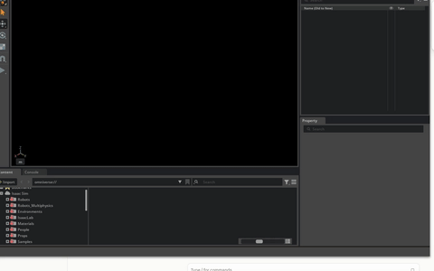

# Lecture 14 — Depth cameras and RGB-D

**Code:** [`lecture14.py`](lecture14.py)

## The one thing this lecture teaches

"Depth" is not one number. `distance_to_image_plane` (Z along the optical
axis) and `distance_to_camera` (true Euclidean range from the camera's
origin) are two different annotators on the same camera, they agree only
at the exact center of the image, and Lecture 13's intrinsics matrix
predicts precisely how far apart they get everywhere else. Backprojecting
a pixel back into a 3D world point only works with the first one — feed
the second one into the same formula and you'd get a silently wrong point.

## Run it

```bash
<your-isaac-sim-install>/python.sh lectures/lecture14.py
```

## What you'll see

```
LECTURE: distance_to_image_plane shape=(240, 320) dtype=float32
LECTURE: distance_to_camera      shape=(240, 320) dtype=float32

LECTURE: distance_to_image_plane -- min=5.00000 max=5.00000 mean=5.00000 (camera height = 5.0)

LECTURE: distance_to_camera / distance_to_image_plane vs sqrt(x^2+y^2+1) prediction: max abs error = 0.000232
LECTURE: center pixel ratio = 1.00000 (should be ~1.0)
LECTURE: corner pixel ratio = 1.03350 (should be > 1.0 -- the corner ray is longer than the straight-down one)

LECTURE: backprojected world points (pixel -> world XYZ), floor is at z=0:
LECTURE:   center       pixel=(160,120) -> world=(-0.000, +0.000, +0.000)
LECTURE:   top-left     pixel=(0,0) -> world=(-1.048, +0.786, -0.000)
LECTURE:   top-right    pixel=(319,0) -> world=(+1.041, +0.786, -0.000)
LECTURE:   bottom-left  pixel=(0,239) -> world=(-1.048, -0.779, -0.000)
LECTURE:   bottom-right pixel=(319,239) -> world=(+1.041, -0.779, -0.000)
```


Both heatmaps share one color scale, which is what makes the left panel's
flatness legible as a real measurement rather than a rendering
coincidence: `distance_to_image_plane` genuinely has nowhere to go, while
`distance_to_camera` visibly grows in every direction away from the
center pixel — the exact `sqrt(x²+y²+1)` ray-length effect the numbers
above quantify.

A real windowed run of `lecture14.py`, the floor, `Sun`, and `Cam` visible in the viewport as the script captures depth and RGB frames from the same camera.



## Walking through it

**A flat, perpendicular floor makes the two depth conventions cleanly
separable.** The scene is deliberately boring: one large flat plane
filling the whole frame, camera looking straight down from a known height
(`5.0m`). Because every pixel hits the exact same surface at the exact
same physical height, `distance_to_image_plane` has nowhere to vary — and
it doesn't: `min=max=mean=5.00000`, to five decimal places. That's what
"distance to the image plane" means literally: the perpendicular distance
from the camera to whatever plane is parallel to the sensor at that depth,
not the distance to the actual surface point a given ray hits.

**`distance_to_camera` is the number a lidar would report; `distance_to
_image_plane` is what a depth camera means by "depth."** They diverge
purely from geometry, not anything about the surface: a pixel's camera-
space ray direction is `(x, y, 1)` where `x = (u-cx)/fx`, `y = (v-cy)/fy`
— the same `fx, fy, cx, cy` Lecture 13 built and verified — and
`distance_to_camera / distance_to_image_plane` equals that ray's length,
`sqrt(x^2 + y^2 + 1)`. The center pixel's ray is `(0, 0, 1)`, length
exactly `1`, so the two depths agree there and nowhere else. Every corner
pixel's ray is off-axis, so its ratio is `> 1` — measured here at `1.0335`,
matching the formula's prediction across the *entire* image to a max error
of `0.000232`, not just at the four sampled corners.

**`get_world_points_from_image_coords()` only works with the planar
one, and the reason is in the formula, not a convention someone chose
arbitrarily.** Its backprojection is `inv(K) @ [u, v, 1]^T * depth` — the
inverse intrinsics matrix gives you the normalized ray direction `(x, y,
1)`, and multiplying by `depth` only reconstructs the true `(X, Y, Z)`
point if `depth` really is `Z`. Feed it `distance_to_camera` (the range)
instead and you'd get a point stretched along that same ray by the
`sqrt(x^2+y^2+1)` factor above — silently wrong, no error raised, exactly
the kind of mistake Lecture 11 made with lidar's `x/y/z` fields, now shown
to be possible with cameras too. Checked here on the image center and all
four corners: every one backprojects to world `z ≈ 0.000` — the floor's
real height — regardless of which pixel or how far off-center it was.

## Try it yourself

1. Swap `sample_depth` to read from `depth_cam` (the `distance_to_camera`
   array) instead of `depth_plane` and rerun the backprojection. How far
   off is each corner's recovered world `z` from `0`, and does the error
   grow with how off-center the pixel is — matching the same ratio this
   lecture measured?
2. Tilt the camera by giving it a small rotation (`UsdGeom.XformCommonAPI
   (cam_geom).SetRotate((10.0, 0.0, 0.0))`) instead of looking straight
   down. Does `distance_to_image_plane` stay constant across the frame
   now, or does it start varying too? What does that say about how narrow
   this lecture's "flat + perpendicular" setup needed to be for the min/
   max/mean check to work as a depth-annotator sanity check in general?
3. Shrink the floor so it no longer fills the whole frame at this camera
   height, and print `depth_plane`'s min/max again. What value shows up
   in the background pixels, and is it something you'd need to filter out
   before backprojecting a real depth image?

## Next

[Lecture 15 — Mapping (occupancy grid)](lecture15.md): turning a sensor's
raw returns — this module's lidar scans, or this lecture's backprojected
depth points — into a persistent 2D map instead of one frame at a time.
