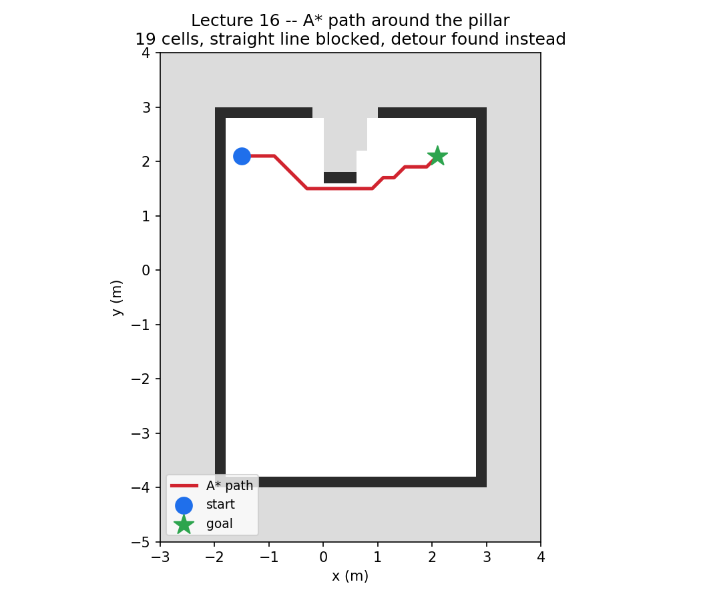

# Lecture 16 — Path planning (A* over an occupancy grid)

**Code:** [`lecture16.py`](lecture16.py)

## The one thing this lecture teaches

Lecture 15's occupancy grid is only useful once something can act on it.
Given a start cell and a goal cell, A* finds the cheapest route through
FREE cells while refusing to enter OCCUPIED or UNKNOWN ones — this
lecture adds one obstacle to the room, confirms in code that it actually
blocks the straight line between two points, and finds and verifies the
detour A* takes around it.

## Run it

```bash
<your-isaac-sim-install>/python.sh lectures/lecture16.py
```

## What you'll see

```
LECTURE: captured 15152189 beam returns, azimuth range [-180.0, 180.0] deg, distance range [1.70, 4.87] m
LECTURE: grid is 35x45 cells at 0.2m/cell -- 738 free, 113 occupied, 724 unknown (Lecture 15 had no pillar: 759 free, 116 occupied, 700 unknown -- compare)
LECTURE: start world=(-1.5, 2.0) -> cell(row,col)=(35, 7), grid value=1 (1=FREE)
LECTURE: goal  world=(2.0, 2.0) -> cell(row,col)=(35, 25), grid value=1 (1=FREE)
LECTURE: straight line start->goal is 3.50 m and BLOCKED by the pillar (sampled 200 points along it)
LECTURE: A* path: 19 cells, 4.10 m (straight-line was 3.50 m -- 0.60 m of detour)

LECTURE: occupancy grid with A* path ('#'=occupied '.'=free ' '=unknown '*'=path 'S'=start 'G'=goal), x:[-3.0,4.0] y:[-5.0,4.0] at 0.2m/cell:
LECTURE:      #########      ##########
LECTURE:      #.........    ..........#
LECTURE:      #.........    ..........#
LECTURE:      #.........    ..........#
LECTURE:      #.S***....   .......G...#
LECTURE:      #.....*...   ....***....#
LECTURE:      #......*..###..**.......#
LECTURE:      #.......*******.........#
LECTURE:      #.......................#
              ...
```



The red line is the actual 19-cell path the script found, converted from
grid cells back to world coordinates — not a hand-drawn detour. It visibly
does what the printed numbers claim: leaves the straight line between `S`
and `G` (which the pillar blocks) and comes back to it once past the
obstacle.

## Walking through it

**The pillar's first placement failed silently, and the fix is itself
worth knowing.** The obvious spot for an obstacle is the midpoint of the
line between start and goal — that's where it was first placed,
`(0.25, -0.5)`, with `start=(-1.5,-3.0)` and `goal=(2.0,2.0)`. The script
ran, exited 0, and reported completely plausible-looking numbers... and
the printed map showed no pillar at all: just the room's four walls, no
detour, straight line reported "clear." Probing the raw returns before
any binning showed why: a full 70-90° azimuth window had *zero* returns
in it — not close ones, none at all, not even the far wall that should
still be visible if the pillar weren't there. `Example_Rotary_2D.json`'s
`profile.nearRangeM` is `1.0` — anything closer than one meter returns
nothing, a real lidar's near-field blind spot, not a bug. That first
pillar's near face sat at `0.26m`, deep inside that radius, and since it
still physically blocked the far wall, the *entire* bearing behind it
went dark: no obstacle, no wall, nothing — the worst kind of silent
failure, because a script that finds no obstacle and reports "clear"
looks identical to one that correctly found no obstacle. This is the
same lesson Lecture 11 taught with `elementsCoordsType` in a new shape:
a wrong assumption about the sensor doesn't crash, it produces a
believable wrong answer, and the only way to catch it is checking the
raw data, not trusting a plausible-looking summary.

**The actual fix reveals a second constraint that isn't obvious from the
first one.** The straight line between the original start and goal
passes just `0.495m` from the sensor at its closest point — inside the
`1.0m` blind radius no matter where along that specific line an obstacle
goes. Moving the obstacle away from that close approach didn't fully fix
it either: nudging it toward either endpoint made its bearing from the
sensor converge on that endpoint's own bearing, occluding the endpoint
itself. The version in the script — `start=(-1.5,2.0)`, `goal=(2.0,2.0)`,
pillar at `(0.25,2.0)` — works because the whole line sits `2.0m` from
the sensor, comfortably outside the blind radius, with the pillar's
`~8°` occlusion shadow nowhere near either endpoint's bearing (`127°`
and `45°`, versus a shadow of roughly `74-91°`). None of this is a
detail about A* — it's Lecture 11's sensor lesson applied to *placing*
geometry, not just reading it.

**"Blocked" isn't asserted, it's checked the same way a real collision
check would be.** `straight_blocked` samples 200 points along the
segment and asks the grid directly whether each one is `FREE` — the same
question a robot's own collision checker would ask, not a geometric
line-vs-box intersection computed from the pillar's known coordinates
(which the planner, working only from the grid, doesn't actually have).

**A* treats UNKNOWN exactly like OCCUPIED, and the printed map shows
why that's the conservative-but-correct choice.** The blank gap behind
the pillar (see the empty band between the two wall segments in the
printed map, around row 6-8) is space the single scan never confirmed as
clear — it's in the pillar's shadow. The path visibly bends around both
the `#` pillar cells and that blank unknown patch, not just the
pillar itself. Nothing stops a different planner from treating unknown
space as merely *expensive* instead of forbidden — useful if the sensor
will re-scan as the robot moves and unknown space might resolve to free
later — but that's a design choice with a real safety tradeoff, not a
default to make silently.

**The path is verified, not just printed.** Three checks run against the
returned path before anything is displayed: every cell in it is `FREE`,
every consecutive pair is actually 8-adjacent (nothing the search
returns can secretly teleport), and the endpoints match the requested
start and goal. Combined with the `0.60m` detour being strictly positive
— proof the path didn't just go straight through the pillar's now-known
footprint — this is the same "verify against ground truth, don't just
trust the printout" habit every lidar lecture in this module used on
sensor data, applied here to a planning algorithm's output instead.

## Try it yourself

1. Move the pillar to `(0.25, -0.5)` — the original, broken placement —
   and rerun. Confirm you get the exact silent failure described above:
   `straight line ... clear` and a path that goes straight through where
   the pillar should be. Then add a print of `dist_m.min()` right after
   the scan; does its value (matching a wall, not the pillar) tip you
   off before you'd need the full per-azimuth probe?
2. Change `NEIGHBORS` to only the four cardinal directions (drop the four
   diagonal entries) and rerun. How much longer is the reported path, and
   does the printed map's `*` trail visibly turn into a staircase instead
   of a diagonal line?
3. Widen the pillar's scale from `(0.6, 0.6, 2.0)` to `(1.4, 1.4, 2.0)`
   until it fully spans the gap between the room's north and south open
   areas at that x-range. Does `astar()` correctly return `None`, and
   does the script's handling of that case make sense as "no path
   exists" rather than looking like another silent failure?

## Next

[Lecture 17 — Humanoid with a ready-to-use policy](lecture17.md): from a
planned 2D path to a robot that can actually attempt to follow one.
