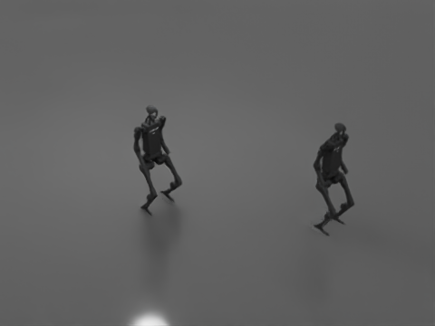
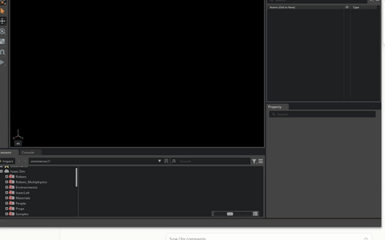

# Lecture 17 — Humanoid with a ready-to-use policy (Unitree H1)

**Code:** [`lecture17.py`](lecture17.py)

## The one thing this lecture teaches

`H1FlatTerrainPolicy` is Lecture 09's PD-drive articulation loop —
stiffness/damping gains, force-mode joints, a target applied every
physics step — with the target generated by a neural network NVIDIA
trained, instead of a constant you picked. This lecture spawns two H1
robots on the same trained policy, commands one to stand still and one
to walk forward, and checks the physics output actually shows different,
physically sane behavior for each. It also documents a real bug this
setup produces if you drive it the way every earlier lecture drove
physics — a bug worth knowing about before you hit it somewhere less
obvious than a lecture script.

## Run it

```bash
<your-isaac-sim-install>/python.sh lectures/lecture17.py
```

## What you'll see

```
LECTURE: policy trained at decimation=4, sim dt=0.005s -- policy inference runs every 4 physics steps (50.0 Hz effective control rate), physics itself steps at 200 Hz
LECTURE: ran 605 physics steps (3.0s sim time)
LECTURE: standing (command=[0,0,0])   -> XY drift=0.059 m, min base height=0.848 m
LECTURE: walking  (command=[0.5,0,0]) -> +X advance=1.308 m, total XY=1.310 m, min base height=0.870 m
LECTURE: naive implied distance at 0.5 m/s x 3.0s = 1.500 m -- compare to the 1.308 m actually measured (ramp-up + real tracking error, not equal)
LECTURE: both robots stayed upright, and the walking command produced clearly more forward motion than standing still -- verified against real physics output, not assumed
```




The chart's x-axis runs a bit past the printed `3.0s` because the trace
kept recording through the extra settle steps used to grab the frame
above — the shape is what matters: a visible ramp-up before the walking
policy reaches its commanded speed, exactly the "ramp-up + real tracking
error" the printed comparison to the naive line already named.

A real windowed run of `lecture17.py`, both `H1_standing` and `H1_walking` humanoids visible mid-stride in the viewport as the pretrained policy drives the walking one.



## Walking through it

**The collapse this script produced first, and why it looked plausible.**
The first version of this lecture drove both robots with the same loop
shape as every earlier one in this course: `for step: policy.forward(dt,
command); kit.update()`. It ran, exited 0, and printed numbers — and
both robots had fallen over. `min_height_standing=0.056`,
`min_height_walking=0.048` — a standing H1's pelvis sits around 0.85-0.9m,
so both had collapsed to the ground within the first half-second.
Worse, `disp_standing=1.159m` and `disp_walking_forward=1.156m` came out
almost identical — not "one stood, one walked," but "both slid/tumbled
about the same amount," which is what a ragdoll does regardless of the
command it was never actually able to track.

**Ruling out the obvious suspects.** Two robots sharing a script raised
an obvious question — cross-talk in the batched Articulation view. A
single-robot isolation test collapsed identically, ruling that out. The
next question was whether this was an environment or GPU/PhysX problem
specific to this machine: a near-verbatim reproduction of NVIDIA's own
`h1_standalone.py` example — same environment USD, same `PhysicsScene`
creation call, same `RenderingManager`/`SimulationManager` setup, same
control loop shape — ran on the same install and stayed upright the
whole time, height stable around 0.88-0.90m, advancing forward as
commanded. That ruled out the engine and the hardware. The bug was in
this script's own loop.

**The actual cause: rendering and physics are decoupled, and a naive
loop assumes they aren't.** `RenderingManager.set_dt(8.0 / 200.0)` tells
Isaac Sim to render once every 8 physics ticks (25Hz) while physics
itself steps at 200Hz — the rate `H1FlatTerrainPolicy` was trained
against. Every earlier lecture's `for step: ...; kit.update()` loop
implicitly assumed one `kit.update()` call advances physics by exactly
one tick. Once render and physics dt are decoupled, that's no longer
true: a single `kit.update()` call can advance physics *several* ticks
internally before control returns to Python. A loop that calls
`policy.forward()` once per `kit.update()` call was therefore only
refreshing the PD target once every several physics ticks — the
articulation spent the rest of those ticks under a stale target,
un-corrected, and a bipedal robot balanced on two small foot contacts
diverges from stale control within a few tenths of a second. The printed
summary still looked complete (`ran 600 physics steps`, real numbers)
because nothing raised an exception — the same "plausible but wrong"
shape as Lecture 16's lidar blind spot, this time from a control-loop
timing assumption instead of a sensor limitation.

**The fix: drive `forward()` from a physics-step callback, not the main
loop.** `SimulationManager.register_callback(on_physics_step,
IsaacEvents.POST_PHYSICS_STEP)` fires exactly once per physics tick,
regardless of how many ticks a single `kit.update()` advances — this is
what NVIDIA's own example does, and it's the reason it never showed the
bug. `lecture17.py`'s callback does exactly two things: on the very
first physics tick it calls `initialize()` on both robots (setting up
the PD gains and default pose, same as Lecture 09's `DriveAPI` setup);
on every tick after that it calls `forward(step_size, command)` for
each robot with its own fixed command vector, so the target is refreshed
at the true 200Hz physics rate the policy expects. After this fix, both
robots hold their height throughout the full 3-second run
(`min_height_standing=0.848m`, `min_height_walking=0.870m`) and the
walking robot's forward displacement (`1.308m`) is over 20x the standing
robot's residual drift (`0.059m`, the small stance-balancing motion a
real standing policy produces — not exactly zero, which is itself a
useful thing to see rather than assume).

**Nucleus dependency, acknowledged rather than hidden.** Every lecture
through 16 built its scenes from primitives — no streamed content. H1's
mesh (`h1.usd`) and its trained locomotion policy (a `.pt` file) can't be
authored that way; they come from Isaac Sim's Nucleus/CDN assets. That
CDN measured 11-27 KB/s over raw `curl` on this network — consistent
with the `pypi.nvidia.com` slowness already documented for `pip` — but
loading the same content *through* Isaac Sim's own asset resolution was
fast (USD reference composition and a small TorchScript file are nothing
like a multi-hundred-MB Python wheel), so this lecture needed no
CDN workaround. It's flagged here because it's the first lecture in this
course where that's true, and it likely won't be the last.

## Try it yourself

1. Replace the callback-driven loop with the original naive shape —
   `for step: standing.forward(dt, cmd); walking.forward(dt, cmd);
   kit.update()` — and rerun. Confirm you reproduce the collapse
   (`min_height_standing` and `min_height_walking` both well under
   `0.6`) even though the script still exits 0.
2. With the naive loop restored, comment out the
   `RenderingManager.set_dt(8.0 / 200.0)` line and rerun. Does the
   collapse still happen? This tells you whether the bug needs the
   render/physics decoupling at all, or whether `kit.update()`'s
   default pacing already doesn't guarantee one physics tick per call.
3. Change `walking_command` to `torch.tensor([0.0, 0.0, 0.5])` (pure
   rotation, no forward velocity) and rerun. Does `disp_walking_forward`
   still make sense as the metric to check, or does this command need a
   different measurement (e.g. total rotation) to verify it actually
   did something distinct from standing still?

## Next

[Lecture 18 — Differential-drive controller on a real robot](lecture18.md):
from a humanoid walking on a pretrained policy to driving a wheeled
robot's joints directly again, this time closing the loop with
odometry.
