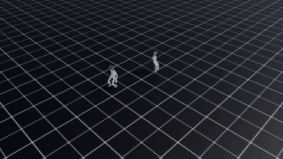

# Lecture 21 — Training G1 to walk with PPO

**Code:** [`lecture21.py`](lecture21.py)

## The one thing this lecture teaches

Lecture 20 ended with every one of 8 environments falling over within 0.5s
of simulated time while holding the robot's default standing pose — the
env samples a nonzero target velocity every episode, and standing still
doesn't track it. Training is what closes that gap. This lecture runs (and
documents) a real 500-iteration PPO training job against
`Isaac-Velocity-Flat-G1-v0` using Isaac Lab's own `rsl_rl` scripts — not a
hand-rolled PPO loop — then loads that run's own final checkpoint back into
the exact task/env-count/step-count window Lecture 20 already measured, and
checks the actual before/after.

## Run it

Training (this is what actually produced the checkpoint and the reward
curve below — expect several minutes, not seconds):

```bash
cd <your-isaac-lab-install>
./isaaclab.sh -p scripts/reinforcement_learning/rsl_rl/train.py \
    --task Isaac-Velocity-Flat-G1-v0 --headless --device cuda:0 \
    --num_envs 2048 --max_iterations 500 --seed 42
```

Then checking what that checkpoint actually does, using this repo's script:

```bash
<your-isaac-lab-install>/isaaclab.sh -p <this-repo>/lectures/lecture21.py \
    --checkpoint <isaaclab-install>/logs/rsl_rl/g1_flat/<timestamp>/model_499.pt \
    --headless --device cuda:0
```

Your own `<timestamp>` directory name will differ — `train.py` prints
`[INFO] Logging experiment in directory: .../logs/rsl_rl/g1_flat` and then
creates a fresh timestamped subdirectory under it each run.

## What you'll see

The real 500-iteration training run's reward curve, parsed from the raw
`train.py` log by [`tools/parse_g1_training_log.py`](../tools/parse_g1_training_log.py)
into `lectures/data_lecture21.npz`, then rendered by
[`tools/render_figures.py`](../tools/render_figures.py):


`lecture21.py`'s own output (`lecture21_results.txt`, for the same fd-1
reason documented in Lecture 20):

```
LECTURE: loaded checkpoint /home/gtu-dsa/robotics/IsaacLab-2.2.1/logs/rsl_rl/g1_flat/2026-08-16_23-56-17/model_499.pt
LECTURE: [trained policy] total reward per env over 100 steps: [2.92, 3.21, 2.81, 2.82, 2.76, 3.3, 3.21, 2.98]
LECTURE: [trained policy] envs that terminated at least once = 0/8
LECTURE: comparison -- Lecture 20's untrained zero-action pass terminated 8/8 over the same 100-step/8-env window; this trained checkpoint terminated 0/8
```

And for reference, NVIDIA's own published pretrained checkpoint for this
same task (`play.py --use_pretrained_checkpoint`, downloaded from Nucleus,
not this course's own training run), walking under a velocity command —
the green/blue arrows above each robot's head are the commanded vs. actual
base velocity:



A real windowed run of `lecture21.py` itself (as opposed to the NVIDIA pretrained-checkpoint GIF above) -- all 8 vectorized environments driven by this course's own trained checkpoint, staying upright instead of collapsing the way Lecture 20's zero-action pass did.


## Walking through it

**The reward curve is not a straight line up, and that's the honest
shape.** For roughly the first 150 iterations, `base_contact` termination
sits pinned at `1.0` — every episode ends in a fall — while mean reward
drifts slowly *down* from about -5 to -11. That's not the training
diverging; `Episode_Reward/action_rate_l2` and the other regularization
penalties keep accumulating turn over turn as episode length creeps up
(`ep_len` climbs from ~12 to ~330 steps over this stretch even though the
robot is still falling every time), so a longer-lived failure costs *more*
reward than a short one, not less. Only after iteration ~165 does
`base_contact` collapse from `1.0` to under `0.05` within about 50
iterations — the point where the policy actually finds a gait that survives
long enough for the tracking rewards (`track_lin_vel_xy_exp`,
`track_ang_vel_z_exp`) to dominate the torque/action penalties instead of
being dominated by them. Anyone judging this run by its reward curve alone
at iteration 100 would reasonably conclude it was getting worse; it wasn't
converged failure, it was the necessary regularization cost of episodes
getting long enough to eventually succeed.

**8/8 terminated with no policy, 0/8 with one, same task, same window.**
Lecture 20's zero-action pass and this lecture's trained-policy pass use
the identical task, `NUM_ENVS=8`, and `N_STEPS=100` — the only variable
that changed is whether the joint targets came from "default pose, held
rigidly" or from this checkpoint's actual output. Every trained-policy
env's per-step reward stayed positive throughout (`total_reward` around
`+2.8` to `+3.3` over 100 steps, versus roughly `-3` to `-4` for the
untrained pass) and none fell — this is the concrete, measured payoff of
the 500 iterations charted above, not an assumed one.

**A second, separate gotcha: two `gym.make()` calls in one process hang.**
The first version of this script tried to reproduce both the untrained
baseline *and* the trained-policy rollout in a single run — create env,
roll out zero actions, `env.close()`, create a second env, load the
checkpoint, roll out. The first environment's creation and rollout
completed normally; the second `gym.make()` call, immediately after the
first one's `close()`, hung indefinitely — no error, no timeout from
Isaac Lab's own code, just no forward progress in the log past "Seed not
set for the environment" for the second scene. This is a different failure
from Lecture 20's fd-1/stdout gotcha (that one still ran to completion,
just silently). The practical fix, and the one this script uses: don't put
two full Kit-backed environments in one process. Every earlier lecture in
this course already followed that rule implicitly by only ever building one
scene per run; this is the first time this course hit what happens when you
don't.

**Why this course leans on `train.py`/`play.py` instead of a hand-rolled PPO
loop.** Every earlier lecture built its own control/observation loop by
hand because that was the point — understanding what `kit.update()` and a
PD-drive loop actually do underneath. PPO itself isn't part of that
underlying-mechanics story; RSL-RL's implementation is a well-tested,
already-correct piece of infrastructure, and Isaac Lab's own
`train.py`/`play.py` scripts are the maintained, documented interface to it.
Re-deriving generalized advantage estimation and a clipped surrogate
objective here would replace a working library with a worse one, for no
pedagogical gain the earlier lectures haven't already delivered on the
underlying physics/control side.

## Try it yourself

1. Rerun training with `--max_iterations 150` instead of `500` (right where
   the reward curve is still near its worst point) and load *that*
   checkpoint into `lecture21.py`. Does it still terminate 0/8, or does it
   land somewhere between Lecture 20's untrained baseline and the full
   500-iteration result — and does the per-env reward magnitude give a
   more informative picture than the termination count alone?
2. Change `lecture21.py`'s `NUM_ENVS` from `8` to `64` and rerun against the
   `model_499.pt` checkpoint. Does the termination rate stay near 0, or does
   a larger sample surface rare failures the 8-env window was too small to
   catch — consistent with the ~0.5% `base_contact` rate the training log
   itself reported at iteration 499 (i.e., roughly 1 in 200 episodes)?
3. Look up `Episode_Reward/joint_deviation_fingers` and
   `Episode_Reward/joint_deviation_arms` in the training log (both present
   from iteration 0, both consistently negative). G1's 37 DOF include
   fingers Lecture 17's H1 didn't have to model at all. Does their
   magnitude relative to `track_lin_vel_xy_exp` suggest the trained policy
   is doing anything deliberate with the hands, or mostly just keeping them
   near their default pose while the legs do the actual work?

## Next

This is currently the last lecture in this course. From here, natural
extensions this lecture sets up but doesn't take: swapping
`Isaac-Velocity-Flat-G1-v0` for the rough-terrain variant
(`Isaac-Velocity-Rough-G1-v0`) already registered alongside it, replacing
the velocity-command task with a goal-reaching one built on Lecture 16's
path planner, or exporting this checkpoint (`export_policy_as_jit` — the
same call `play.py` already makes) and driving it from a hand-written
physics-step callback the way Lecture 17 drove H1's pretrained policy.
